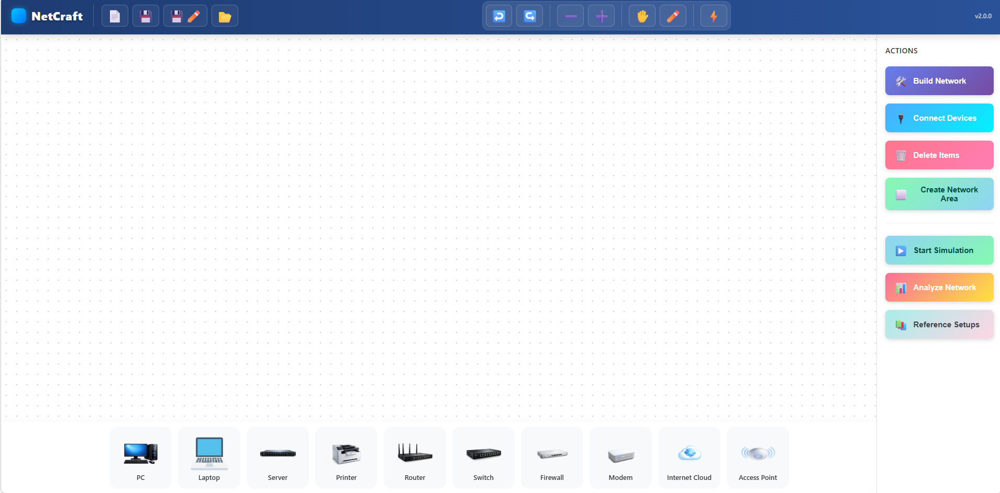

# NetCraft — Etkileşimli Ağ Topolojisi Simülatörü

NetCraft, kullanıcıların bilgisayar ağlarının nasıl kurulduğunu **görsel olarak öğrenmesini sağlayan etkileşimli bir ağ simülatörüdür**.

Kullanıcılar ağ cihazlarını sürükleyip bırakarak topolojiler oluşturabilir, cihazları birbirine bağlayabilir ve **paket akışını gerçek zamanlı olarak gözlemleyebilir**.

NetCraft'ın amacı karmaşık ağ yapılandırmalarına girmeden, **ağ mimarisini ve cihazların nasıl çalıştığını basit ve görsel bir şekilde öğretmektir.**

---
# Ekran Görüntüleri

# Canlı Demo

Projeyi canlı olarak deneyebilirsiniz:

🔗 netcraft-mu.vercel.app

---

# Özellikler

• Sürükle bırak ile ağ cihazları yerleştirme  
• Farklı kablo türleri ile bağlantı oluşturma (Copper, Fiber, Coax, Console)  
• Gerçek zamanlı paket akışı simülasyonu  
• Otomatik ağ analizi sistemi  
• Adım adım ağ kurulum rehberi  
• Hazır referans ağ topolojileri  
• WiFi ve kablolu ağ desteği  

---

# Desteklenen Ağ Senaryoları

NetCraft içerisinde farklı ağ mimarilerini öğrenmek için rehberli senaryolar bulunmaktadır.

## Ev Ağı (Home Network)

Basit bir ev ağı simülasyonu.

İçerir:

• Router  
• WiFi bağlantısı  
• Kablolu bilgisayarlar  
• İnternet bağlantısı

---

## Ofis LAN Ağı

Küçük ofis ortamını simüle eden ağ yapısı.

İçerir:

• Gateway Router  
• Firewall  
• Switch  
• Çalışan bilgisayarlar  
• Yazıcı ve sunucu gibi paylaşılan kaynaklar

---

## Kampüs / MAN Ağı

Birden fazla alanı birbirine bağlayan geniş ölçekli ağ yapısı.

İçerir:

• Core Router  
• Core Switch  
• Distribution Switch'ler  
• Birden fazla ağ bölgesi

---

## WAN Edge (Kurumsal Ağ Kenarı)

Kurumsal ağların internet bağlantısını ve güvenlik mimarisini simüle eder.

İçerir:

• Internet Cloud  
• Edge Router  
• Firewall  
• Internal Network  
• DMZ (opsiyonel)

---

# Simülasyon Motoru

NetCraft içerisinde özel olarak geliştirilmiş bir ağ simülasyon motoru bulunmaktadır.

Simülasyon şu ağ davranışlarını görselleştirir:

• LAN paket trafiği  
• WAN trafiği  
• WiFi iletişimi  
• Broadcast keşif paketleri  
• Gateway istekleri  
• Firewall olmayan ağlarda temel tehdit simülasyonu

---

# Paket Renkleri

Simülasyonda farklı paket türleri renklerle gösterilir.

| Renk | Anlamı |
|-----|------|
| Yeşil | Yerel ağ trafiği |
| Sarı | Broadcast veya WiFi iletişimi |
| Kırmızı | İnternet / WAN trafiği |

---

# Ağ Analizi

NetCraft oluşturulan topolojiyi otomatik olarak analiz eder ve ağın doğru kurulup kurulmadığını kontrol eder.

Analiz şu durumları tespit eder:

• Eksik cihazlar  
• Yanlış kablo bağlantıları  
• İnternet bağlantısı eksikliği  
• Güvenlik mimarisi problemleri  
• Eksik ağ segmentleri

Örnek analiz çıktısı:

Network Analysis  
Status: VALID  

Report:  
Home Network Ready  
- Router bağlı  
- Tüm bağlantılar aktif  

Segments: 1

---

# Kullanılan Teknolojiler

Frontend: JavaScript / TypeScript  
Arayüz: HTML + Canvas tabanlı topoloji çizimi  
Build Tool: Vite  
Deployment: Vercel  
Versiyon Kontrol: GitHub  

---

# Projenin Amacı

NetCraft özellikle şu kullanıcılar için geliştirilmiştir:

• Ağ temellerini öğrenmek isteyen öğrenciler  
• Siber güvenlik ile ilgilenen kişiler  
• SOC ve network eğitimine yeni başlayanlar  

Amaç karmaşık konfigürasyonlar yerine **ağ mimarisini görsel olarak öğretmektir.**

---

# Gelecek Geliştirmeler

Planlanan geliştirmeler:

• VLAN görselleştirme  
• Paket inceleme modu  
• Ağ saldırı simülasyonları  
• SOC eğitim senaryoları  
• Spanning Tree döngü tespiti  
• Trafik izleme paneli

---

# Geliştirici

YUNUS EMRE AKÇİÇEK

---

# Lisans

Bu proje MIT lisansı ile açık kaynak olarak paylaşılmıştır.

Bu proje MIT lisansı ile açık kaynak olarak paylaşılmıştır.

